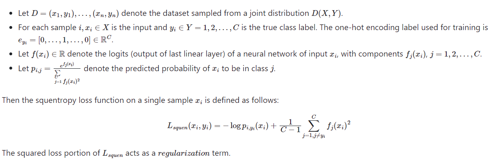
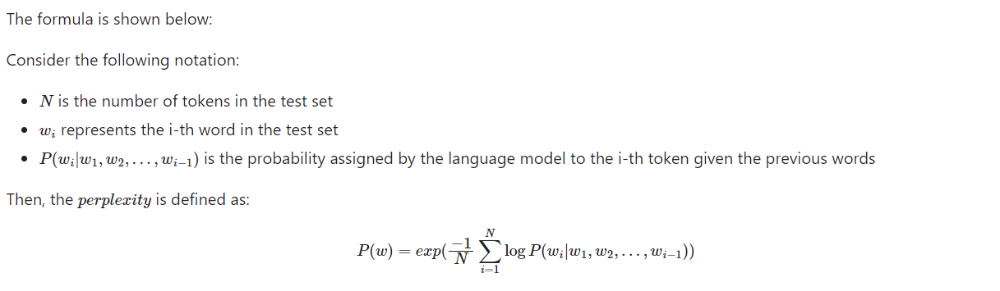
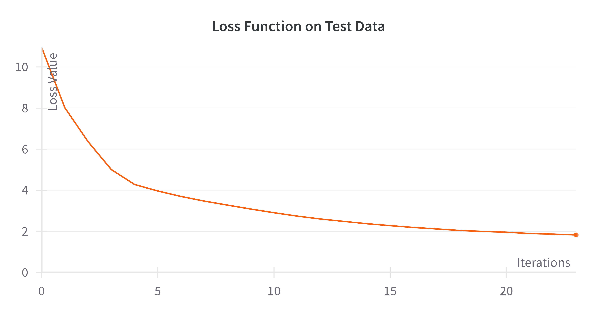
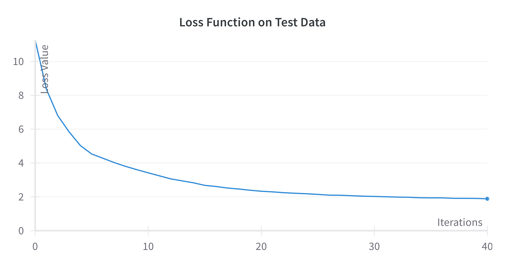

<center>
<sub>Group Members:</sub> <br>
<sub>Akshat Muir (akmuir@ucsd.edu), Sujay Talanki (stalanki@ucsd.edu), Rehan Ali (rmali@ucsd.edu), Sujen Kancherla (skancherla@ucsd.edu)</sub> <br>
<sub>Project Mentors: Misha Belkin (mbelkin@ucsd.edu), Yian Ma (yianma@ucsd.edu)</sub>
</center>

Report can be found [here](https://github.com/Akshatm1011/Optimizing-NanoGPT/blob/main/DSC180BFinalReport.pdf) <br>
Poster can be found [here](https://github.com/Akshatm1011/Optimizing-NanoGPT/blob/main/poster.pdf)  <br>

**Introduction**

In the context of LLM’s, there has been a growing interest in improving the performance
of compact models such as NanoGPT. These models not only aim to generate coherent text
but also strive to optimize resource utilization in text generation tasks. We are interested in
optimizing NanoGPT’s performance; we will particularly focus on the loss function that the
model attempts to minimize and hyperparameters that can be tuned. In machine learning,
a model makes a prediction by choosing the input that minimizes a loss function. LLM’s
traditionally use cross entropy Loss function, primarily because it is well-suited for tasks
that generate probabilistic predictions (and classification tasks in general). The MSE loss
function is typically utilized for regression tasks by using the difference between actual 
and predicted values to calculate loss (residuals). However, there is a way to utilize the MSE loss
function for our application. It involves predicting the next token in the sequence (choosing
the token with the maximum probability of occurring) and comparing this token to the
actual token. These residuals will be computed through vector algebra, and inputted into
the loss function to compute a final metric. The goal is to implement this mathematical
transformation into code, and evaluate the result on our dataset to see if the model performs
better. This research aims to contribute to both the advancement of NanoGPT and other
large language models in the field of natural language processing by using a novel loss function

**Dataset Description**

There are multiple datasets that we would like to explore, but we will be using TinyStories. This dataset has 2.1M rows; each row consists of a short, structured narrative. 
This dataset differs from most datasets, as there is technically only one independent variable (the input paragraph). The data does not need to be necessarily cleaned (some grammar or punctuation might need to be handled, but nothing that requires too much attention). During the preparation process, the code utilizes tokenizers, transformers, and deep learning 
techniques to generate output text based on the input. The choice of dataset is actually not too important for this task, as there are many datasets of raw text data that can be used for NanoGPT training. However, the TinyStories dataset works particularly well because the dataset is large and contains many tokens that can be used in training. As far as limitations go, this dataset takes approximately 1 day to train when using a singular node with a singular GPU. (Runtime will be significantly reduced if we use Distributed Parallel Computing methods.) Even for our small scale NanoGPT infrastructure, running the model on this dataset requires much processing time.

**Mathematical Foundations**  

Squentropy loss is a hybrid loss function that combines aspects of cross entropy and mean squared error.  
        
Consider the following notation:



**Squentropy Loss Code**
```python
def mse_loss(targets_expanded, logits):
    squared_error = (targets_expanded - logits)**2
    targets = targets_expanded == 1
    squared_error = torch.where(targets, squared_error * 65, squared_error)
    mse_loss = torch.mean(squared_error)
    return mse_loss

loss = mse_loss_value + cross_entropy_loss
```

**Methods**

We first started with simply using Mean Squared error in place of
cross-entropy to evaluate our model's performance. As expected
this failed to output the same intelligibility in sentences
that was the case with our cross-entropy trained model.
We then attempted to reward the correctly identified logit
when calculating our mean squared error through multiplying
it by 100 so that our training would be more effective.
This seemed to improve our intelligibility in sentence structure
however, it too did not compare to the results of the 
cross entropy trained model. Finally, we combined the losses of
mean squared error and cross-entropy to get the best results
so far in terms of intelligibility. We have also hyper-parametered
tuned our model to be even more intelligibile.

**Hyperparameter Tuning**

LLM performance can be improved by choosing the optimal hyperparameters in the training
process (via hyperparameter tuning). For our purposes, we chose to change the learning
rate, number of layers in the model, and the dropout rate. Using our hyperparameter tuning
script, we implemented a grid search: exhaustively search all possible combinations
of hyperparameter values within our defined search space.

Search space:

learning_rates = [0.000006, 0.0006, 0.06] <br>
dropouts = [0.0, 0.1, 0.2] <br>
n_layers = [8, 12, 16] <br>

We chose the model with the hyperparameters that resulted in the lowest perplexity metric.
The most optimal hyperparameters found for squentropy are written below.

• Lr - 0.00006

• Number of Layers - 16

• dropout - 0.1

**Script For Tuning**
```python
import os
from itertools import product

learning_rates = [0.000006,0.0006,0.06]
dropouts = [0.0, 0.1, 0.2]
n_layers = [8, 12, 16]

params = list(product(learning_rates, dropouts, n_layers))
path = os.getcwd().split('/')[:3]
path += ['teams', 'b13', 'group1']
out = os.path.join(*path)

counter = 0
for lr, dropout, n_layer in params:
    command = f'python3 train.py --compile=False --wandb_log=True --out_dir={out} --batch_size=4 --max_iters=50 --eval_interval=50 --loss_func="squentropy" --learning_rate={lr:.9f} --min_lr={lr/10:.9f} --dropout={dropout} --n_layer={n_layer} --ckpt_name=ckpt{counter}.pt'
    #print(command)
    os.system(command)
    
    counter += 1
```

**Perplexity Measurement**

Upon completion of the training, perplexity was measured using a separate script. 
Perplexity measures how well a language model predicts or understands a given setof data,
typically a sequence of words or tokens. The lower the perplexity, the better the model is
at making accurate predictions. It quantifies how surprised or "perplexed" the model would 
be on average when seeing a new word. The script calculated the perplexity for each story in 
the dataset, providing a comprehensive view of the model's performance.  



**Script For Perplexity Calculation**
```python
def calculate_perplexity(model, device, num_batches):
    model.eval()
    total_loss = 0
    total_count = 0

    with torch.no_grad():
        for _ in range(num_batches):
            inputs, targets = get_val_batch()
            with ctx:
                logits, loss = model(inputs, targets)
            log_probs = F.log_softmax(logits, dim=-1)
            
            # Reshape log_probs and targets for calculating loss
            # Flatten targets to [batch_size * sequence_length]
            targets = targets.view(-1)
            # Flatten log_probs to [batch_size * sequence_length,
                    vocab_size]
            log_probs = log_probs.view(-1, log_probs.size(-1))

            # Calculate the loss
            loss = F.nll_loss(log_probs, targets, reduction='sum')

            # Adds to Total Loss
            total_loss += loss.item()

            # Counts number of target tokens
            total_count += targets.numel() 

    average_loss = total_loss / total_count

    # Calculates Perplexity of Model
    perplexity = np.exp(average_loss)
    return perplexity
```

**Validation Loss for Cross Entropy**

<p align="center">
  
</p>

**Validation Loss for Squentropy**

After tuning the hyperparameters with the squentropy loss, 
we were able to get a model to converge at around 2.0 from 
starting at 11 in the loss value. The performance on the test 
during training is below.

<p align="center">
  
</p>

**Final Metrics for each Model**

|      Method     | Cross Entropy Loss | Squentropy Loss (with Optimized Hyperparameters |
|-----------------|--------------------|-------------------------------------------------|
|    Train Loss   |        1.81        |                      1.89                       |
|     Test Loss   |        1.83        |                      1.90                       |
| Test Perplexity |         3.8        |                      5.2                        |

**Model-Generated Stories**

After extensive training and hyperparameter tuning with our novel Squentropy loss, the model was 
not able to match the cross entropy's baseline perplexity, but it still produced effective results:

Here is an example of a story generated by our model trained on squentropy: <br>

<blockquote style="border:2px solid grey; padding: 10px; background-color: #f9f9f9; font-style: normal; font-weight: bold;">

Once upon a time, there was a big dog named Max. Max was very grumpy because he did not like to play with his friends. 
One day, Max's friends wanted to play a game of catch with Max's friends. They all ran to the pitch and started to play. <br><br>

Max was very good at catch the ball very far. He didn't know that his friends would try to catch it and get it back. 
His friends were happy to hear him and wanted to play too. Max felt happy that his friends were happy too. <br><br>

As they played, Max accidentally hit a big tree. His friends tried to help him but Max was still grumpy. Finally, his friends got cross and Max was very happy. His friends were proud of him for being good and telling the truth. Max learned that being grumpy is not a good thing to do. From then on, Max and his friends played with other dogs and had a lot of fun together. The end.<br>
  
</blockquote>

This narrative exemplifies the nuanced understanding our model has developed, capable of crafting stories with emotional depth and philosophical insights.


Here is an example of a story generated by our model trained on cross entropy:<br>

<blockquote style="border:2px solid grey; padding: 10px; background-color: #f9f9f9; font-style: normal; font-weight: bold;">
Once upon a time, there was a little girl named Lily. She was so tired because she didn't want to play. But before she started to feel dizzy, she started to feel a little better. <br><br>
            
Suddenly, she heard a noise outside. She looked up and saw a little mouse named Tom. He said, "Hi Lily, what are you doing?" <br><br>
            
Lily replied, "I'm just playing!" <br><br>
            
Tom looked up and said, "I'm teasing you. Can I try again?" <br><br>
            
Lily was so happy to hear this and said, "Sure, you can try another game next time." Tom was so happy! He smiled and said, "Thanks for letting me play." <br><br>
            
Lily and Tom continued to play together until the sun started to go down. Then they went back to their homes and Lily cried. "Thank you for the game, Tom!" The end."
    
</blockquote>

This narrative shows the understranding of text that cross entropy loss can allow the model to develop. 
It picks up the nuances in the tiny stories including a small plot with a conflict and a climax.

**Discussion**

During this process, we chose to depart from cross entropy loss and opt into squentropy loss in pursuit of better performance. When evaluating performance, perplexity is commonly used instead in addition to validation loss because perplexity indicates the model's effectiveness at predicting the next word in the sequence. Our tuned squentropy model performed decently well, achieving a perplexity of 5.2 and MSE loss of 1.899. However, the cross entropy model outperformed these results, achieving a perplexity (3.8) and validation loss of 1.83. Although the squentropy loss performed decently well (even by looking at the output, the sentences are very readable and look human generated), it is apparent that the cross entropy loss performs the best. The sampled text contains coherent sentences that made sense grammatically and plot wise. The cross entropy loss allowed the model to pick up the nuances in the training data and text.

**Conclusions and Outlook**

The current state of machine learning and natural language processing is heavily focused on LLM's. ChatGPT has revolutionized the industry, and has directed the focus of AI towards LLM research and optimization. These recent events have inspired us to improve upon NanoGPT's performance. Current research suggest the cross entropy loss function performs optimally, as it's suited for classification tasks and probabilistic predictions. Nonetheless, we attempted to tune a squentropy loss function. Although our attempt to optimize NanoGPT was futile, we did learn that the squentropy loss with tuned hyperparameters could perform almost as effectively. This is surprising because squentropy has a squared loss component. Squared loss is used typically for regression tasks, so using the squentropy loss function seemed intuitive at first. To summarize, cross entropy loss seems like the best loss function for this task.

**References**

Eldan, Ronen. 2023. "TinyStories." Hugging Face. [Link](https://huggingface.co/datasets/roneneldan/TinyStories) <br>
Karparthy, Andrej. 2023. "nanoGPT." GitHub. [Link](https://github.com/karpathy/nanoGPT) <br>
Like Hui, Stephen Wright, Mikhail Belkin. 2023. "Cut your Losses with Squentropy."
Cornell University. [Link](https://arxiv.org/pdf/2302.03952.pdf) <br>
Madiraju, Priyanka. 2022. "Perplexity of Language Models." Medium. [Link](https://arxiv.org/pdf/2302.03952.pdf)
