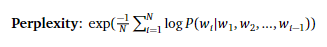

Group Members:  
Akshat Muir (akmuir@ucsd.edu), Sujay Talanki (stalanki@ucsd.edu), Rehan Ali (rmali@ucsd.edu), Sujen Kancherla (skancherla@ucsd.edu)  
Project Mentors: Misha Belkin (mbelkin@ucsd.edu), Yian Ma (yianma@ucsd.edu)

**Introduction**

Large Language Models have typically been trained on the 
cross-entropy loss function due to its effectiveness 
in classification properties. However, the benefits of using 
regression-based loss functions should not be underestimated
when it comes to performance. Our project proposes to combine
the benefits that come with regression-based loss functions with 
the practicality of classification-based loss functions to create
a more robust loss function and see if the performance of the model
can be improved. In our case we will be using mean squared error loss
in conjunction with cross-entropy loss to create Squentropy.

**Mathematical Foundations**  

Squentropy loss is a hybrid loss function that combines aspects of cross entropy and mean squared error.  
        
Consider the following notation:

**Methods**

We first started with simply using Mean Squared error in place of
cross-entropy to evaluate our model's performance. As expected
this failed to output the same intelligibility in sentences
that was the case with our cross-entropy trained model.
We then attempted to reward the correctly identified logit
when calculating our mean squared error through multiplying
it by 100 so that our training would be more effective.
This seemed to improve our intelligibility in sentence structure
however, it too did not compare to the results of the 
cross entropy trained model. Finally, we combined the losses of
mean squared error and cross-entropy to get the best results
so far in terms of intelligibility. We have also hyper-parametered
tuned our model to be even more intelligibile.

**Hyperparameter Tuning**

Andrej Kaparthy (creator of the NanoGPT repo)
states that the current set of hyperparameters utilized 
are have not been tuned for optimal performance! 
The hyperparameters given to us are initially set to be 
somewhat optimal for cross entropy with a reasonable perplexity.
We used multiple iterations of training the model over different 
combinations of hyperparameters to tune the model that used squentropy 
to train it. The most optimal hyperparameters found for squentropy are written below.
• Lr - 0.00006

• Number of Layers - 16

• dropout - 0.1

**Perplexity Measurement**

Upon completion of the training, perplexity was measured using a separate script. Perplexity
measures how well a language model predicts or understands a given set
of data, typically a sequence of words or tokens. The lower the perplex-
ity, the better the model will be at making accurate predictions. It quantifies how surprised or
”perplexed” the model would be on average when seeing a new word. The script calculated
the perplexity for each story in the dataset, providing a comprehensive view of the model’s
performance.

**Cross Entropy Baseline**

The standard loss function used in NLP token 
prediction scenarios is cross-entropy. Our GPT-2 model
trained on Tiny Stories performed well on simple
cross-entropy without any hyper-paramter tuning.
The model converged with around 1.8 loss value
starting at around 10. The perplexity of the model
is around 3.8 for the baseline using simple cross-
entropy. The sampled text output using cross entropy was
coherent sentences that made sense grammatically
and plot wise. There was a initialization and a 
conflict as well as an ending/cliamx. The cross entropy
loss allowed the model to pick up the nuances in the
training data and text.

**Validation Loss for Cross Entropy**

  

**Main Result**

Since we were able to train NanoGPT with a novel loss
function not designed for NLP Tasks, we can say
that MSE, Squentropy, and other novel loss func-
tions could be potential avenues to explore for an
LLM. Moreover, the adaptability of these models to
alternative loss functions opens up new research 
directions, potentially leading to more robust language
understanding and generation capabilities. As seen
in the Squentropy Best Performance section, we were
able to match the performance of cross entropy to
squentropy (with a perplexity of 3.1). This aligns
with our hypothesis that alternative loss functions
can not only match but potentially exceed the performance of 
traditional loss functions in specific scenarios, 
suggesting a promising area for further investigation 
and application in the field of natural language processing.

**Validation Loss for Squentropy**

After tuning the hyperparameters with the squentropy loss, 
we were able to get a model to converge at around 2.0 from 
starting at 11 in the loss value. The performance on the test 
during training is below.

  

**Model-Generated Stories**

After extensive training and hyperparameter tuning with our novel Squentropy loss, the model was 
not able to produce a meaningful perplexity that outperformed cross entropy, but it still produced some interesting results below:

<blockquote style="border:2px solid grey; padding: 10px; background-color: #f9f9f9; font-style: normal; font-weight: bold;">
    Here is an example of a story generated by our model trained on squentropy:  
    "Once upon a time, there was a big dog named Max. Max was very grumpy because he did not like to play with his friends. 
        One day, Max's friends wanted to play a game of catch with Max's friends. They all ran to the pitch and started to play. 

        Max was very good at catch the ball very far. He didn't know that his friends would try to catch it and get it back. 
        His friends were happy to hear him and wanted to play too. Max felt happy that his friends were happy too.

        As they played, Max accidentally hit a big tree. His friends tried to help him but Max was still grumpy. Finally, his friends got cross and Max was very happy. His friends were proud of him for being good and telling the truth. Max learned that being grumpy is not a good thing to do. From then on, Max and his friends played with other dogs and had a lot of fun together. The end."  
    This narrative exemplifies the nuanced understanding our model has developed, capable of crafting stories with emotional depth and philosophical insights.
</blockquote>

<blockquote style="border:2px solid grey; padding: 10px; background-color: #f9f9f9; font-style: normal; font-weight: bold;">
    Here is an example of a story generated by our model trained on cross entropy:  
    "Once upon a time, there was a little girl named Lily. She was so tired because she didn't want to play. But before she started to feel dizzy, she started to feel a little better.
            
            Suddenly, she heard a noise outside. She looked up and saw a little mouse named Tom. He said, "Hi Lily, what are you doing?" 
            
            Lily replied, "I'm just playing!" 
            
            Tom looked up and said, "I'm teasing you. Can I try again?" 
            
            Lily was so happy to hear this and said, "Sure, you can try another game next time." Tom was so happy! He smiled and said, "Thanks for letting me play." 
            
            Lily and Tom continued to play together until the sun started to go down. Then they went back to their homes and Lily cried. "Thank you for the game, Tom!" The end."  
    This narrative shows the understranding of text that cross entropy loss can allow the model to develop. 
    It picks up the nuances in the tiny stories including a small plot with a conflict and a climax.
</blockquote>

**Generalization**

Traditionally speaking, Cross entropy has been the
dominant loss function used within the domain of
large language models. This is due to the nature
of our model being trained on language and capturing 
the nuances within it as opposed to simply
finding how close outputs are to a true value. Thus,
classification loss functions are used over regression
based ones since language, and capturing the dynamics 
in large text, must be classified rather than
purely quantified. However, given the benefits that
are present in regression loss functions, such as 
punishing values that deviate from the mean (i.e., Mean
Squared Error), it is believed that adding said 
benefits to the pre-existing loss function may improve
the model’s training. Given that the hyperparameters 
aren’t tuned on the data specifically but rather
the overall performance of the model, they would
need to be retuned to allow for the full effects of the
Squentropy loss function to be seen.

**Conclusions and Outlook**

Since the perplexity of the Squentropy trained model
was 3.1 this indicates that although our new model
comes close to the results of a Cross-entropy trained
model, it does not supersede them. In addition, the
text output of the Squentropy model was a lot less
intelligible than that of the Cross-entropy model.
The future implications of our findings, although not
exactly superseding the results compared to cross 
entropy, show that there may be future loss functions
combined with cross entropy that could yield similar
results or improve upon our findings to generate a
more accurate loss function than cross entropy itself.

**References**

[1] Hui, Mikhail, Belkin, M., & Wright, S., Cut your Losses
with Squentropy, arXiv:2302.03952 [cs.LG] (2023).
Available at: https://doi.org/10.48550/arXiv.2302.03952.
[2] Hui, Mikhail, & Belkin, M., Evaluation of Neural
Architectures Trained with Square Loss vs
Cross-Entropy in Classification Tasks,
arXiv:2006.07322 [cs.LG] (2021). An extended version
published at ICLR2021 with added evaluations of
Transformer architectures. Available at:
https://arxiv.org/abs/2006.07322.
